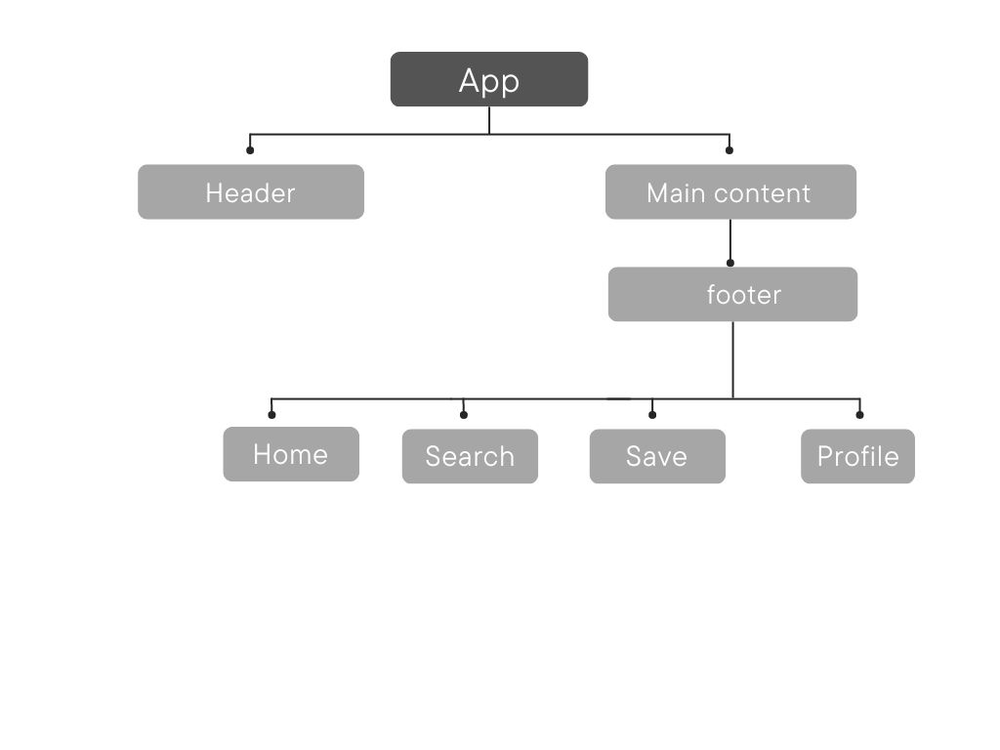

# Footer Component

The Footer component serves as a navigation and interaction element at the bottom of the application. It incorporates React icons to enhance visual appeal and provides clickable functionality for users.

# Introduction

The Footer component is designed to be a reusable UI element that provides essential navigation links and interaction options to users at the bottom of the application. It utilizes React Router for seamless navigation between different sections of the app and integrates Font Awesome icons for visual representation.

## Installation of the necessary dependencies:

- npm install react-router-dom
- npm install react-icons

## Importing the Footer component into your project:

- import Footer from './Footer'; into the App.jsx Component.
- Place the <Footer /> component at the bottom of your application layout.

Once installed and imported, you can use the Footer component within your React application by simply rendering it as part of your layout. The component automatically provides navigation links and interaction elements at the bottom of the application.

## code snippet.

    import React from 'react';
    import Footer from './Footer';

    const App = () => {
      return (
        

          {/* Other application content */}
          <Footer />
        

      );
    };

    export default App;

## Component Structure

- The Footer component follows a simple structure:

- Footer: Parent component responsible for rendering the footer section.
- Navigation Links: Provides links to various sections of the application such as Home, Blog, Save/Bookmark, Profile/User. etc.
- Blog Button: Represents a specific action within the app, allowing users to access Blog post section.

## React Icon Implimentation

- The Footer component utilizes the react-icons library to import and display icons for navigation links and interaction elements. Icons are imported as components and integrated within the Footer component for seamless rendering.

## Example of how to use/import react icons into the Footer component within your React application:

    import React from 'react';
    import { BrowserRouter as Router } from 'react-router-dom';
    import Footer from './Footer';

    const App = () => {
      return (
        <Router>
          

            {/* Other application content */}
            <Footer />
          

        </Router>
      );
    };

    export default App;

## flow diagram illustration of component relationship between the Footer component and the rest of the application:

